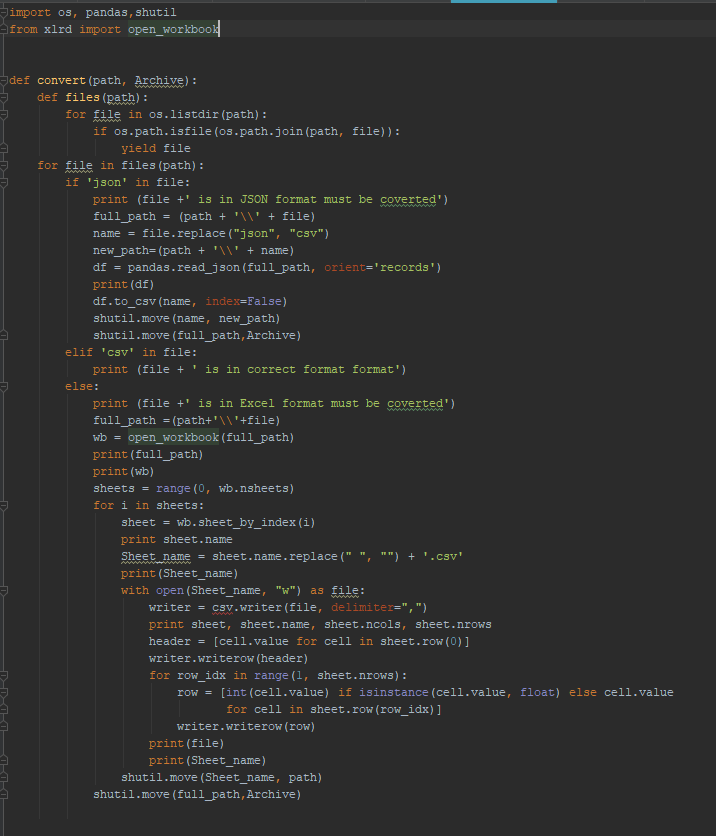
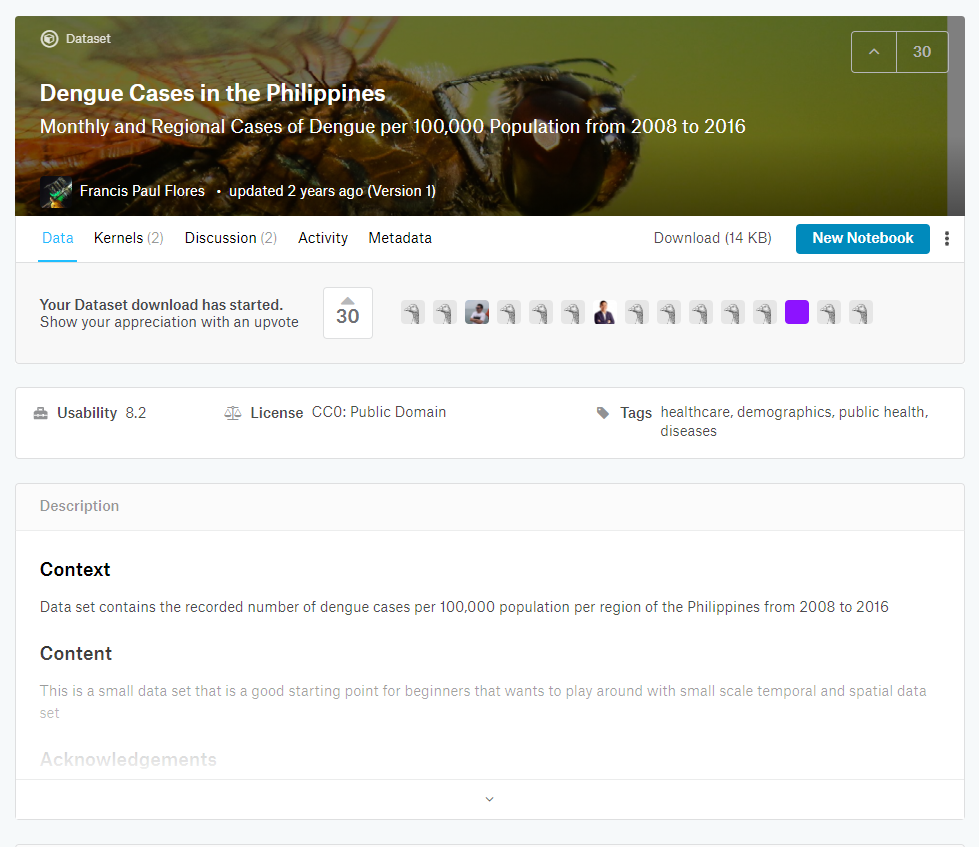
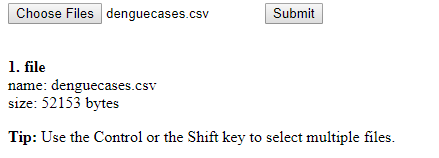
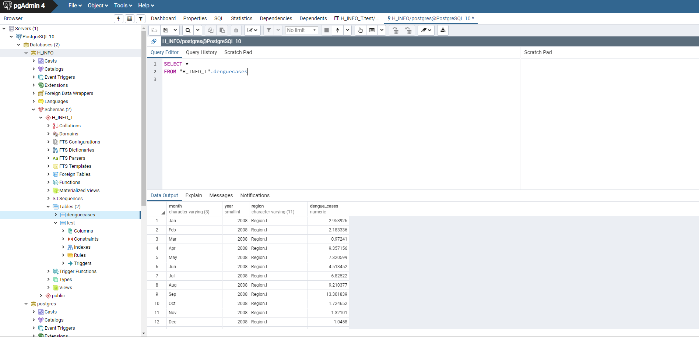
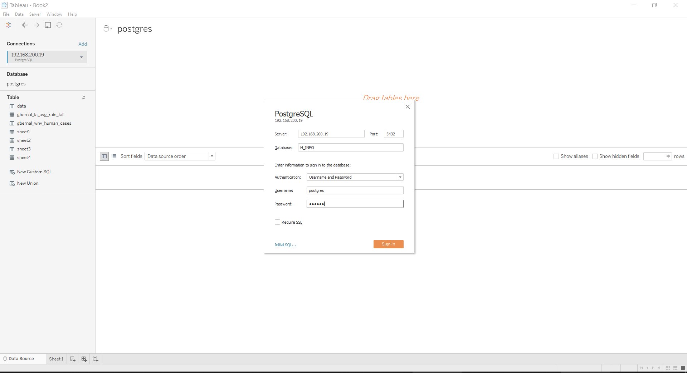
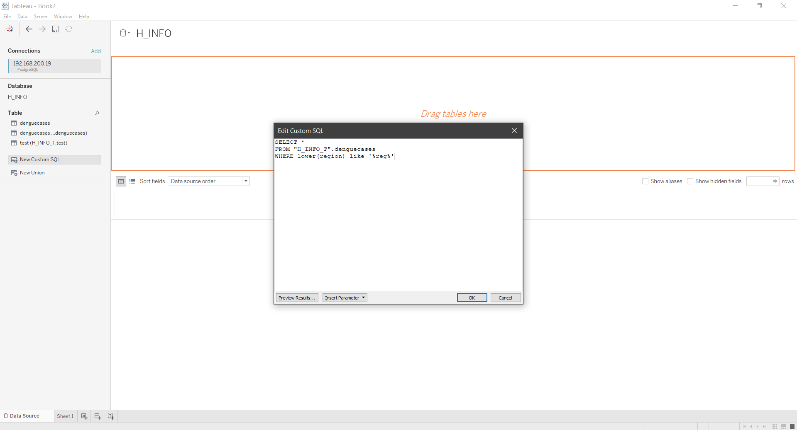
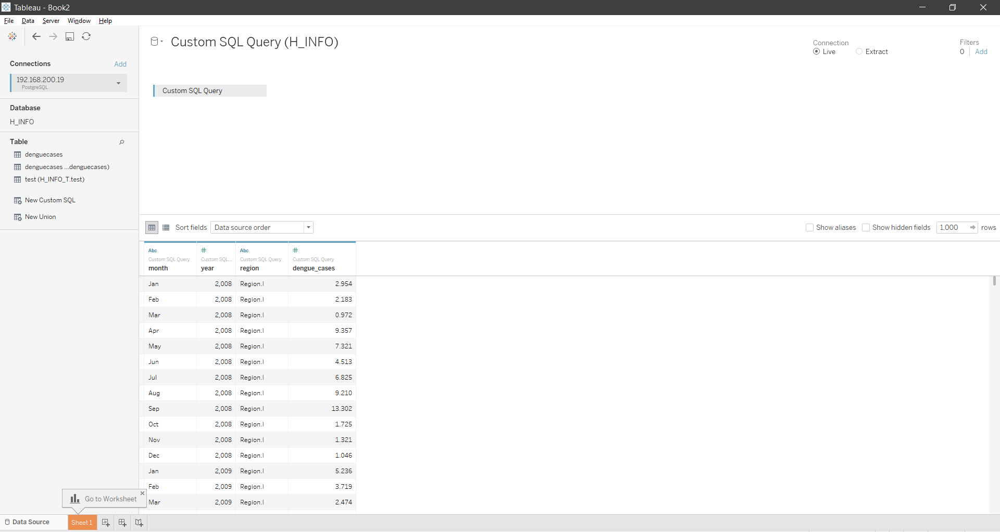
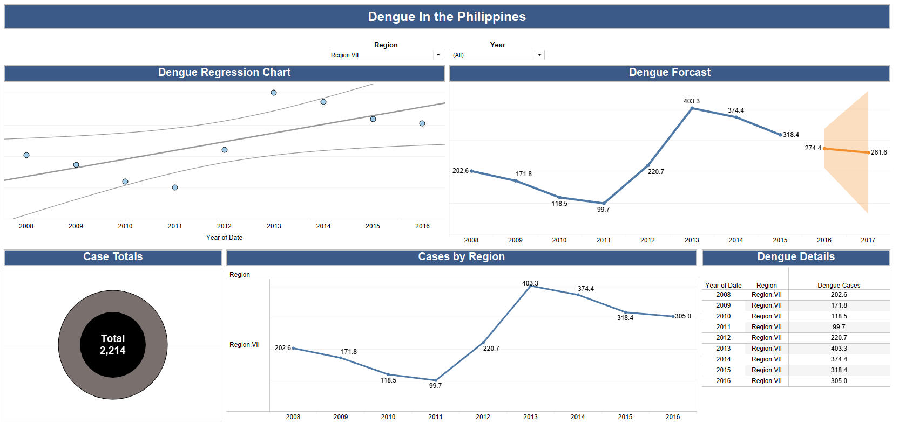
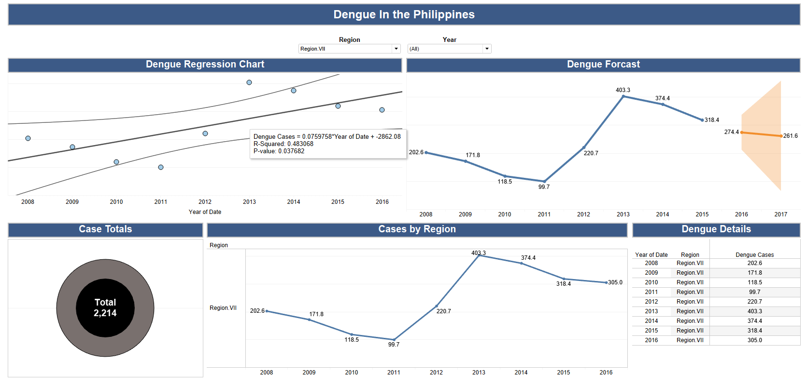

# Gilbert Anthony Bernal MSDS-696 Data Science Project

## Overview
The data science project that was worked on for the Regis MSDS 696 practicum is titled "Establishment of Regis Healthcare Informatics Database – Continued". The goal of this project was to continue from the last data science project and to complete building the database for the Regis Health Informatics school. In the previous project I picked the best database to use based on the requirements and created python codes to create database tables based of CSV files and upload the data a from these files to its unique table. After this an analysis was done to show a proof on concept on how these codes work an can be used. In this project continuation new python codes were created to allow for multiple file types to be used with the previous code used to create tables. This allows users the ability to use different file types instead of just a single one. A new code was also created to add data governance to the database. This makes it so the database stays clean by removing tables that are not being used any more. After the codes were created the PostgreSQL database was then created on the Regis sever. The codes used for the local database where then copied over to the server for testing. Chron scheduler was then added to the database as well to allow for code automation. This created a way for the Python codes to run on a consistent time. A HTML form was then created to allow users to upload files to the database. This makes it so the user can upload a file from their local computer to the Regis server for the scheduled codes to take the uploaded file and created their unique table for them. An analysis on Dengue fever cases in the Philippines was then done to show a proof of concept on how these codes and database could be used by students in the Regis Health Informatics School. 

## Requirements & Goal
For this project continuation there were numerous goals and requirements. The first goal was to create a way to allow for multiple data formats to be used with the previous project code. The previous code only allowed for CSV files. After looking through multiple health care organization databases CSV, JSON, and Excel were the most common formats that the databases stored their data in. Since the previous project’s codes took CSV files a code had to updated or created to allow for JSON and Excel files to run with the previous project codes. The next goal was to create a python code to add data governance to the database. This needed to be done so that the database stayed clean. If data governance was not added to this database, then there would be unused data on it. This unused data would take up unnecessary space that could make it harder to find data and fill up the allowed space for the database. The next goal was to create the PostgreSQL server on Regis Server. The database needed to be created on the server to test and all related codes. This had to be done to make any necessary updates to the codes as needed to make sure they ran successfully on the server. After this was done the next goal was to create a way to automate these codes on a consistent schedule. This had to be done so that if any individual were to upload a file to the server the codes needed to create their unique table would run within a reasonable time to create their table based off their file. Last goal and requirement was to create a HTML webform to allow for a file to be uploaded to the server. This webform allows users to upload a file from their local drive to the server so that their file can be created into a unique table for them to use. 
## Tools

### PostgreSQL
PostgreSQL is a free open source object-relational database system that uses the standard SQL language and extends the language with various features. The reason why this database was chosen in the previous project is because it cost nothing to download, use, and works well with CSV files. It also has a command that allows for quick CSV file upload called COPY. This command created a simple and quick way to upload the files to the table created for it. 

### Python
Python is an open source high level programming language. The reason why Python was chosen for this and the previous project is that it has various libraries that work well with PostgreSQL and has other libraries that could help with the goals of the project.
### Python Libraries Used
Below are the new Python libraries used for this project not previously used in the previous

**PANDAS:**
The PANDAS library is used to allow python to work and use data structures and data analysis tools. The reason why this library was used for this code was to take in JSON files and convert them to CSV files for the previous project codes to create a unique table for it. 

**XLRD:**
XLRD is a python library that allows python to work with Microsoft Excel spreadsheets. This library was needed in order go through an excel file, identify each sheet, and create a CSV based off each of the sheets within the file. These new CSV files are then turned into unique tables by the previous project codes. 

**TOUCH:**
The TOUCH library allows python to use a Linux command called touch. Touch allows for the creation of blank files. The was required for this project because it created a way to generate trigger files needed for the KSH files used for the Chron scheduler.  

### Chron

Chron is a UNIX tool that is used to schedule commands or script on a server to run automatically at a time the user chooses. This tool was chosen to automate the table creation and data governance codes. 

### HTML
HTML is a web-based code used to create websites. HTML was used for this project to create a webform to allow users to upload their data to the server to have a unique table created based on the file uploaded. 

### Tableau

Tableau is an analytical tool that can be used for building dashboards, live reporting, and analytics. This tool was chosen over other analytical tools because of its ability to connect directly to databases, ability to run SQL queries, built in functions, and for its ability to do complete analysis with the data loaded to the tool. 

# Part 1: Create Python Code
Two Python codes were created for this project. The two codes create where Convert.py and Database_Governance.py.

**Convert.py:** This code is used convert JSON and Excel files to a CSV file. The reason why they are being converted to CSV is because the codes used in the previous project for creating the unique tables works only with files in a  CSV format. Covering these files to a CSV instead of updating the previous code saved time, did not risk issues when updating previous code, and was the least path of resistance. This code works by using different python libraries for the file conversion. For JSON files PANDAS was used. PANDAS was chosen because of how it works with JSON files and its ability to export data frames to CSV. XLRD is used to go through each of the excel sheets within a file and covert them to a CSV file. This will turn a single excel file into a multiple CSV files depending on the number of sheets within it. The code uses an if statement to decide what library to use for conversion. 

**Database_Governance.py:** This code is used to check the last modified date age of a file that was used for creating a unique table. Based on the age of the file the code will go through and decide if the unique table created from that file needs to be deleted. If it does need to be deleted it connects to the PostgreSQL server and runs a drop table statement with the name of the of the file/table name.

# Part 2: Create PostgreSQL database on Regis server 
## Previous Project Issues

When working on the previous project I tried to create the PostgreSQL database on the server. When trying to do so I ran into a connection issue. When trying to connect I would either run into a timeout error. If I was able to connect, I would get disconnected after a period of time. After working to resolve this issue and testing with putty and WinSCP the issue was resolved. Once this issue was resolved the commands needed to install. Once the database was installed a new user was created along with a new database call H_INFO. Once this was done the database connections were modified to allow all users access from their local machine. 

**Step 1:** Run Commands needed for PostgreSQL database installation.

**Step 2:** Create new database for health informatics school

**Step 3:** Create new user

**Step 4:** Open connections for database use

# Part 3: Copy and test all database python codes on server  

The codes created for this project have all been used on a local desktop database. To test them further for productional use they needed to be testing on the Regis server itself. All directories and codes used were copied on the server using WinSCP. Once they were copied to the server, they were then updated to use the server directories. Once this was done, they were tested and updated until they ran successfully. 

**Step 1:** Create directories needed for python codes on server

**Step 2:** Copy all python codes and data files for testing. 

**Step 3:** Update files to use directories and Regis server

**Step 3:** Run files for testing 

**Step 4:** Check database for validation

# Part 4: Install Chron scheduler on Regis server and create KSH files

To automate the table creation process and data governance check chon was installed on the Regis server to schedule when these codes need to run. To scheduler these codes for automation ksh files needed to be created to run the code. These codes were created for both the data governance and table creation codes. These codes were set to run on a 15 minute internal and will continue to run until a trigger file is found. Once it is found the file stops running. If there are any error an email would be sent to whoever is chosen to look into the issue. 

**Step 1:** Install Chron on Regis server

**Step 2:** Create ksh files for both the data upload and data governance codes. 

**Step 3:** Add ksh files to Chron scheduler. 

# Part 4: Create HTML webform

A webform was created to allow users to upload their data to the Regis sever from their local machine. This creates a way for students to upload their data to have a unique table created for them. 

# Part 5: Run Analysis to show proof of concept

## Background

To test the database created and the Python codes used to manage the database on the Regis server an analysis was done to provide a proof of concept. Since this practicum required a machine learning technique. The machine learning technique chosen for this project was regression. The reason why dengue fever was chosen as a health issue is because dengue cases have been increasing throughout the world. Dengue is a virus that is spread to people through the bite of an infected Aedes aegypti mosquito (“Dengue”, N.D.). Throughout the world there is an estimate of 3 billion people that are at risk of dengue fever. Out of these 3 billion at risk up to 400 million people get infected with dengue and out of these 400 a 100 million become ill. Out of the ones that become ill 22 thousand are estimated to get a sever case of dengue and die. Since dengue fever has been increasing throughout the world and there is no cure dengue fever is a major health issue and is why it was done for the proof of concept analysis for this project. 

## Overview

For this project data was first collected from Kaggle. Kaggle is a site that stores data of various topics from different sources. Kaggle stores data in different data types and because of this it was used for all the python code testing. The data from Kaggle that was used as a proof of concept was dengue fever data from the Philippines. This data had 8 years of data for multiple regions throughout the Philippines. Once this data was downloaded it was then uploaded to the server using the HTML webform. After this I waited 15 min for the scheduler to run. The scheduler could have done it but then there is no way to see the actual code running. Once these codes were a simple query was ran to make sure that the data was in the database. After that the database was connected to Tableau to run the analysis and build a dashboard to tell a story with the data. 
For this project data was 

**Step 1: Obtain Data**

**Step 2: Upload file to Server**

**Step 3: Wait 15 min for scheduler and run simple query for table**

**Step 4:Connect to Tableau**

**Step 5: Import Data into Tableau**

**Step 6: Create Report**

# Results
When looking at the regression model that was created by Tableau on top left chart, we can see that our linear regression line was not a good fit. Visually we can see that the line goes through the middle of the chart and does not come close to any of the points. Even when looking at the R-Squared and P-value we can even numerically see that it is not a good fit. When looking at the data line and forecast part of the report on the top right. We can see that dengue fever spiked in 2013 and ha slightly started to decline. The forecast created by Tableau even predicts that the number of cases would also decrease. 
To look into another example of this a filter was added to select a single region. To identify the region with the highest number of cases the pie chart was used. By hovering over it to use the tool tip we could see that Region VII had the highest number of cases. When looking at this region alone we can see that the regression line was a better fit visually and numerically. Our forecasting line even shows that a slight decrease. This is consistent with what was seen when using the overall results.  	

# Conclusion
When looking at the overall goal of the project we can see that the goals and requirements were met. The tools used for this project helped make sure that the database could run independently with little maintenance. This could be seen with the proof of concept used for this project. This project shows and creates a way to allow students to upload data to a database and use it as needed. This project and proof of concept can help all student and not just those in the health informatics school. This is because some students at Regis must sign up or pay to have their data stored by various companies. Making this project a process used by Regis could help students by providing them a way to store their data to be used for their classes. 

# References 
Flores, F. P. (2017, October 30). Dengue Cases in the Philippines. Retrieved August 22, 2019, from https://www.kaggle.com/grosvenpaul/dengue-cases-in-the-philippines

The World's Most Advanced Open Source Relational Database. (n.d.). Retrieved June 26, 2019, from https://www.postgresql.org/

Welcome to Python.org. (n.d.). Retrieved June 26, 2019, from https://www.python.org/

Youtube Presentation: https://www.youtube.com/watch?v=wn3sZCkwmDg&feature=youtu.be
